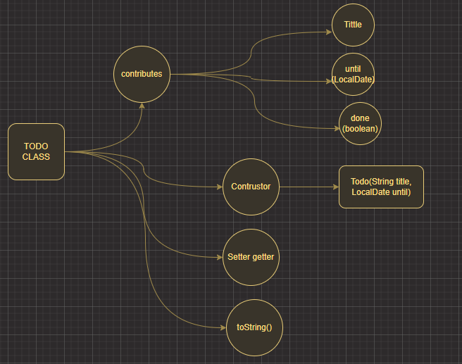

# KTECT JAVA PROJECT 1

## TODO Application
KTech 백엔드 과겅의 틀 안에서 진행되는 개인 포로젝트이다.

TODO Application은 할 일을 기록하고 추적하기 위해 Java로 간단한 애플리케이션이다.

이 애플리케이션을 사용하면 사용자는 할 일 목록에서 할 일 항목을 추가, 표시, 수정 및 삭제할 수 있습니다.
## 스택
- Java Standard Library
- Java Collection Framework
- Java Time API (java.time)
- Java I/O

## 실행
1. 본 Repository를 clone 반는다.
2. Intellij IDEA를 이용해 clone 반은 폴더를 연다.
3. "TodoApp.java"를 실행한다

## 내가 이걸 만들면서 고민했던 내용

## 완수한 요구 사향
- [x] 첫화면
- [ ] 종료하기
- [ ] TODO 만들기
- [x] TODO 수정하기
- [x] TODO 완료하기
- [x] TODO 삭제하기
- [ ] 재시작해도 TODO 유지
- [ ] 오류 입력에 대한 대응
